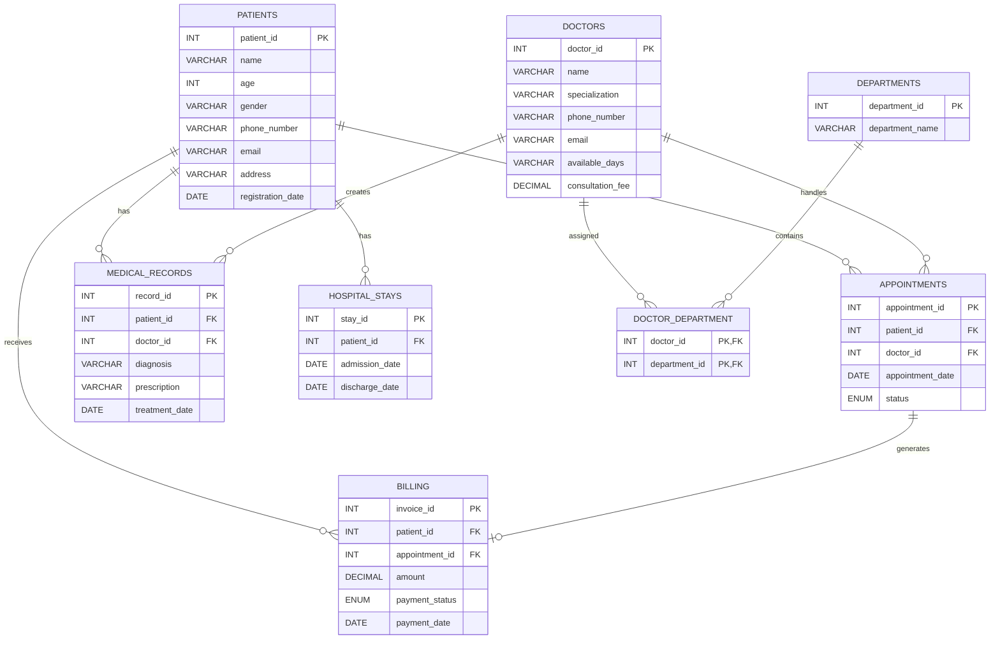
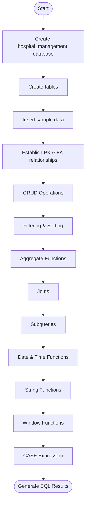
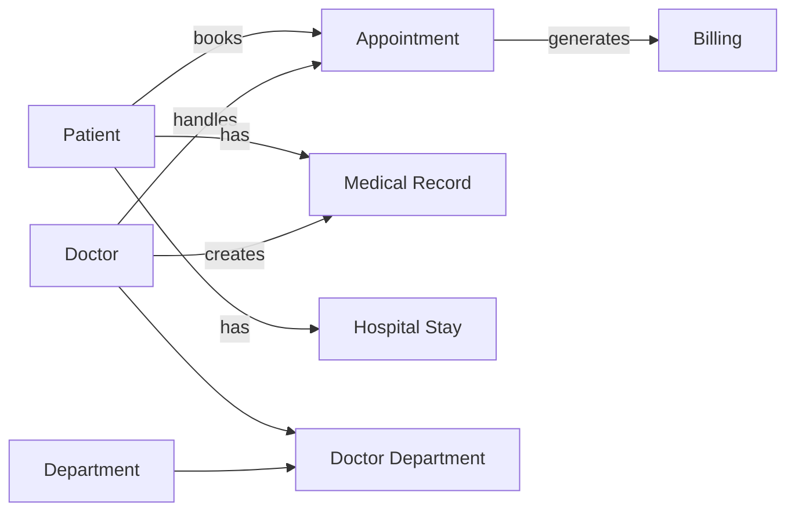
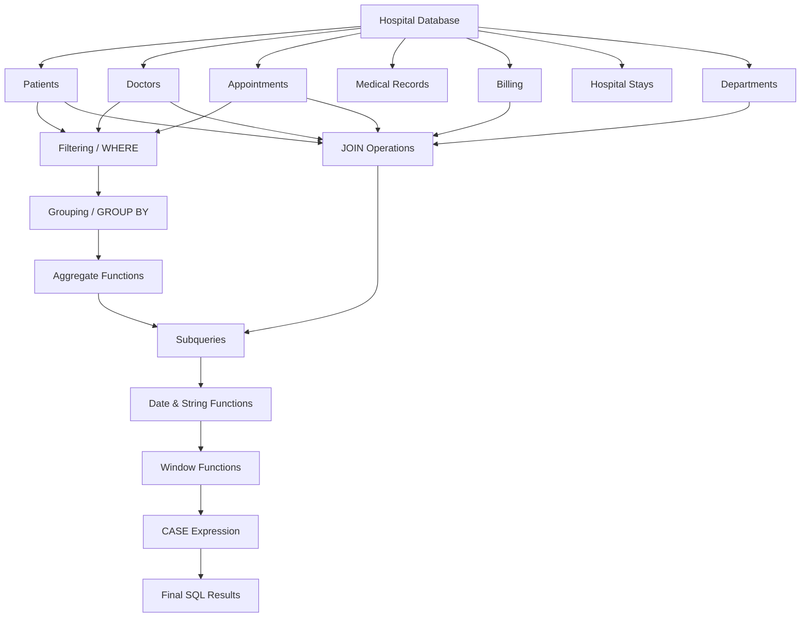

# 🏥 Hospital Management System — SQL Practical Exam (Set C)

> **Database:** `hospital_management`  
> **SQL Dialect:** MySQL  
> **Project Type:** Hospital Management Database & SQL Practical  
> **Repository File:** `hospital_management.sql`

---

## 📌 Project Overview

This project implements a **Hospital Management System** using MySQL. It is designed according to the Practical Exam – Set C requirements and demonstrates database design, relationships, CRUD operations, filtering, grouping, aggregate functions, joins, subqueries, date/time functions, string functions, window functions, and `CASE` expressions.

The SQL script creates the database from scratch, creates the required tables, inserts sample records, establishes primary/foreign-key relationships, and executes the required SQL tasks.

The database creation and table definitions are included in the supplied SQL script. fileciteturn0file0L1-L15

---

## 🎯 Objectives

- Create a structured hospital database.
- Store patient, doctor, appointment, medical-record, billing, hospital-stay, and department information.
- Establish Primary Key and Foreign Key relationships.
- Perform CRUD operations.
- Practice `WHERE`, `HAVING`, `LIMIT`, `ORDER BY`, and `GROUP BY`.
- Use aggregate functions such as `SUM`, `AVG`, `MAX`, `MIN`, and `COUNT`.
- Implement `INNER JOIN`, `LEFT JOIN`, `RIGHT JOIN`, and a MySQL-compatible `FULL OUTER JOIN` approach.
- Use subqueries.
- Apply date/time and string functions.
- Demonstrate window functions such as `RANK()` and running totals.
- Categorize patients using a `CASE` expression.

---

# 🗂️ Database Schema

The project contains the following tables:

| Table | Purpose |
|---|---|
| `Patients` | Stores patient personal and registration information |
| `Doctors` | Stores doctor details, specialization, availability, and consultation fee |
| `Appointments` | Stores appointments between patients and doctors |
| `Medical_Records` | Stores diagnosis, prescription, and treatment information |
| `Hospital_Stays` | Stores patient admission and discharge details |
| `Billing` | Stores invoices, amounts, payment status, and payment dates |
| `Departments` | Stores hospital departments |
| `Doctor_Department` | Mapping table between doctors and departments |

The supplied SQL defines the `Patients`, `Doctors`, `Appointments`, `Medical_Records`, `Hospital_Stays`, `Billing`, `Departments`, and `Doctor_Department` tables with their keys and relationships. fileciteturn0file0L7-L80

---

# 🔗 Entity Relationship Diagram



---

# 🔄 Database Workflow



---

# 🧩 Data Relationship Flow



---

# 🛠️ Installation & Setup

## 1. Open MySQL

You can use:

- MySQL Workbench
- MySQL Command Line
- VS Code with a MySQL extension

## 2. Run the SQL Script

Open:

```text
hospital_management.sql
```

Then execute the complete script.

The script first removes an existing `hospital_management` database, creates it again, and selects it for use. fileciteturn0file0L1-L5

### Command

```sql
SOURCE hospital_management.sql;
```

Or open the file in MySQL Workbench and click **Execute**.

---

# 📊 Tables & Relationships

## 1. Patients

Stores:

- Patient ID
- Name
- Age
- Gender
- Phone Number
- Email
- Address
- Registration Date

```sql
patient_id INT PRIMARY KEY
```

---

## 2. Doctors

Stores:

- Doctor ID
- Doctor Name
- Specialization
- Phone Number
- Email
- Available Days
- Consultation Fee

The supplied data includes specializations such as Cardiology, Neurology, Dermatology, Pediatrics, Orthopedics, Gynecology, and General Medicine. fileciteturn0file0L144-L152

---

## 3. Appointments

Connects patients with doctors.

```text
Patients → Appointments ← Doctors
```

The appointment status is restricted to:

```text
Scheduled
Completed
Cancelled
```

The SQL defines both `patient_id` and `doctor_id` as foreign keys. fileciteturn0file0L29-L36

---

## 4. Medical Records

Stores:

- Diagnosis
- Prescription
- Treatment Date
- Patient
- Doctor

The supplied script links medical records to both patients and doctors using foreign keys. fileciteturn0file0L39-L47

---

## 5. Hospital Stays

Stores:

- Stay ID
- Patient ID
- Admission Date
- Discharge Date

This table is used for calculating the duration of a patient's hospital stay. fileciteturn0file0L50-L56

---

## 6. Billing

Stores:

- Invoice ID
- Patient ID
- Appointment ID
- Amount
- Payment Status
- Payment Date

Payment status values are:

```text
Paid
Pending
Cancelled
```

The appointment relationship uses `ON DELETE CASCADE` in the supplied script. fileciteturn0file0L58-L67

---

## 7. Departments

Stores hospital department information.

```sql
department_id INT PRIMARY KEY
department_name VARCHAR(100)
```

---

## 8. Doctor_Department

This is the mapping table between doctors and departments.

It uses a **composite primary key**:

```sql
PRIMARY KEY (doctor_id, department_id)
```

Both columns are foreign keys. fileciteturn0file0L69-L80

---

# 📝 SQL Tasks Implemented

## 1. CRUD Operations

The script demonstrates:

- `INSERT`
- `UPDATE`
- `DELETE`

Examples include adding a new patient, doctor, and appointment, updating a patient's address, and deleting cancelled appointments older than six months. fileciteturn0file0L416-L421

---

## 2. SQL Clauses

Implemented:

- `WHERE`
- `HAVING`
- `LIMIT`

Examples:

```sql
SELECT *
FROM Doctors
WHERE consultation_fee > 1000;
```

```sql
ORDER BY total_spent DESC
LIMIT 5;
```

The supplied script uses these clauses for recent patients, highest-spending patients, and doctors charging more than ₹1,000. fileciteturn0file0L423-L428

---

## 3. SQL Operators

Implemented:

- `AND`
- `OR` / `IN`
- `NOT`

Examples include scheduled appointments for a particular doctor, doctors specializing in Cardiology or Neurology, and patients without a recent appointment. fileciteturn0file0L430-L438

---

## 4. Sorting & Grouping

Implemented:

```sql
ORDER BY
GROUP BY
```

The script sorts doctors by specialization and groups appointment/patient counts by doctor and revenue by department. fileciteturn0file0L440-L452

---

# 📈 Aggregate Functions

The following functions are demonstrated:

| Function | Usage |
|---|---|
| `SUM()` | Total paid revenue |
| `AVG()` | Average consultation fee |
| `COUNT()` | Number of visits/patients |
| `MAX()` | Used through a subquery to identify the maximum spending |
| `MIN()` | Included in the practical requirement set |

The supplied SQL calculates total paid revenue, the most visited doctor, and average consultation fee. fileciteturn0file0L454-L460

---

# 🔗 Join Operations

## INNER JOIN

Used to retrieve doctors with their department names.


## LEFT JOIN

Used to retrieve patients and their completed appointments.

## RIGHT JOIN

Used to find appointments that have no corresponding billing record.

## FULL OUTER JOIN

MySQL does not directly support `FULL OUTER JOIN`. The supplied script uses a `UNION` of two `LEFT JOIN` queries to achieve the required result. fileciteturn0file0L465-L485

---

# 🔍 Subqueries

The project demonstrates three subquery tasks:

1. Find doctors who have handled more than 50 patients.
2. Find the patient who spent the most on billing.
3. Find appointments where the doctor specializes in Dermatology.

These queries are included in the supplied SQL script. fileciteturn0file0L487-L501

---

# 📅 Date & Time Functions

Implemented functions include:

### `MONTH()`

Counts appointments by month.

### `DATEDIFF()`

Calculates hospital-stay duration:

```sql
DATEDIFF(discharge_date, admission_date)
```

### `DATE_FORMAT()`

Formats treatment dates as:

```text
DD-MM-YYYY
```

These date/time queries are included in the SQL script. fileciteturn0file0L503-L509

---

# 🔤 String Functions

The project demonstrates:

### `UPPER()`

Converts patient names to uppercase.

### `TRIM()`

Removes extra spaces from doctor names.

### `COALESCE()`

Replaces missing doctor phone numbers with:

```text
Not Available
```

These functions are implemented in the supplied script. fileciteturn0file0L511-L514

---

# 🪟 Window Functions

The project includes:

## 1. Doctor Ranking

```sql
RANK() OVER (...)
```

Ranks doctors based on appointment/patient count.

## 2. Cumulative Revenue

```sql
SUM(SUM(amount)) OVER (...)
```

Calculates cumulative paid revenue by month.

## 3. Running Appointment Total

```sql
COUNT(*) OVER (...)
```

Displays the running total of appointments.

The three window-function queries are included in the supplied SQL. fileciteturn0file0L516-L533

---

# 🧠 CASE Expression — Patient Risk Level

Patients are categorized according to the number of medical records:

```text
More than 5 records  → High
3–5 records          → Medium
Otherwise            → Low
```

SQL logic:

```sql
CASE
    WHEN COUNT(m.record_id) > 5 THEN 'High'
    WHEN COUNT(m.record_id) BETWEEN 3 AND 5 THEN 'Medium'
    ELSE 'Low'
END
```

This logic is implemented in the supplied script. fileciteturn0file0L535-L543

---

# 🔄 Query Execution Flowchart



---

# 📁 Suggested GitHub Repository Structure

```text
hospital-management/
│
├── hospital_management.sql
├── README.md
└── outputs/
    └── hospital_management_outputs.xlsx
```

### Recommended GitHub files

| File | Purpose |
|---|---|
| `hospital_management.sql` | Complete database creation, data, relationships and SQL queries |
| `README.md` | Project documentation, schema and flowcharts |
| `outputs/hospital_management_outputs.xlsx` | Query output documentation |

---

# ▶️ How to Run

### Step 1
Open MySQL Workbench.

### Step 2
Open:

```text
hospital_management.sql
```

### Step 3
Execute the complete script.

### Step 4
Verify the database:

```sql
SHOW DATABASES;
```

### Step 5
Select the database:

```sql
USE hospital_management;
```

### Step 6
Check tables:

```sql
SHOW TABLES;
```

### Step 7
Check table data:

```sql
SELECT * FROM Patients;
SELECT * FROM Doctors;
SELECT * FROM Appointments;
SELECT * FROM Medical_Records;
SELECT * FROM Hospital_Stays;
SELECT * FROM Billing;
SELECT * FROM Departments;
SELECT * FROM Doctor_Department;
```

---

# 📊 Sample Data

The supplied SQL script contains:

- **60 patients**
- **8 doctors**
- **100 appointments**
- **33 medical records**
- **15 hospital stays**
- **86 billing records**
- **7 departments**
- **8 doctor-department mappings**

The patient dataset runs from patient ID 1 through 60, and the appointment dataset contains 100 records. fileciteturn0file0L82-L142 fileciteturn0file0L173-L273

---

# ⚠️ Notes

- This project is written for **MySQL**.
- `FULL OUTER JOIN` is implemented using `UNION` because MySQL does not provide a native `FULL OUTER JOIN`.
- The supplied SQL uses sample/demo hospital data.
- The SQL script recreates the database using `DROP DATABASE IF EXISTS`, so running it will replace an existing database with the same name.
- The supplied schema does **not** contain a doctor `experience` column, so the separate requirement about categorizing doctors by years of experience is not represented in the provided SQL script. No unsupported experience field has been added here.

---

# 👩‍💻 Technologies Used

- **MySQL**
- **SQL**
- **MySQL Workbench / VS Code**
- **GitHub**
- **Markdown**
- **Mermaid Flowcharts**

---

# ✅ Practical Exam Coverage

```text
CRUD Operations              ✅
WHERE / HAVING / LIMIT       ✅
AND / OR / NOT               ✅
ORDER BY / GROUP BY          ✅
Aggregate Functions          ✅
Primary & Foreign Keys      ✅
INNER JOIN                   ✅
LEFT JOIN                    ✅
RIGHT JOIN                   ✅
FULL OUTER JOIN Equivalent   ✅
Subqueries                   ✅
Date & Time Functions        ✅
String Functions             ✅
Window Functions             ✅
CASE Expression              ✅
Database Documentation       ✅
Flowcharts                   ✅
```

---

## 🏁 Conclusion

The **Hospital Management System** demonstrates how a relational database can be designed and queried to manage hospital operations. It combines relational database design with practical SQL concepts required for the Set C practical examination.

---

## 👨‍💻 Author

**Armin Khareghat**  
B.Sc. Computer Science  
🤖 AI / ML & Data Science  

---

## 📜 License

This project is created for **educational and learning purposes**.

---

⭐ If you found this project useful, consider giving the repository a star!

